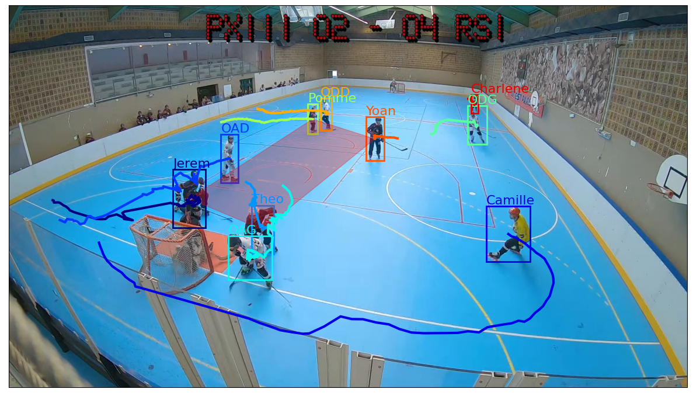

# Roller Hockey player tracker

A player tracker for Roller hockey games.



:warning: only tested with fixed high-resolution camera.

## Installation

Requirements:

  - `python3`
  - `ffmpeg` for clip and frames extraction
  - `youtube-dl` to download the video
  - `matplotlib` to display the trajectories
  - `opencv-contrib-python` for some image processing tools
  - `torch`, `torchvision` for player detection and other neural network things
  - `sklearn` for other machine learning tools
  - `numpy`, `tqdm`


## Processing a clip

First you need to create a project:

```sh
python -m rhtrack.project https://www.youtube.com/watch\?v\=SOME_ID PROJECT_NAME
```

Then you can process a clip, say a 8 seconds clip starting at 32:22:

```sh
python -m rhtrack.clip --start=00:32:22 --duration=8 --num-workers=5 \
    --project=PROJECT_NAME clip-1
```

This will create trajectories chunks to label with player names.

Open the file `PROJECT_NAME/clip-1/trajectories/players.txt` :

```
0: player_name
1: player_name
...
```

Each index corresponds to an image in `PROJECT_NAME/clip-1/trajectories/`.

Open the image to identify the player and replace `player_name` on the corresponding
line with the name of the player.

Leave empty (i.e. just remove `player_name`) if you don't want this trajectory in
the final video.


Once you're done, run:

```sh
python -m rhtrack.render --project=PROJECT_NAME clip-1
```

which will create the video: `PROJECT_NAME/clip-1/output.mp4`.
